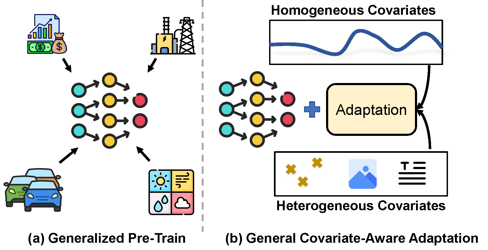
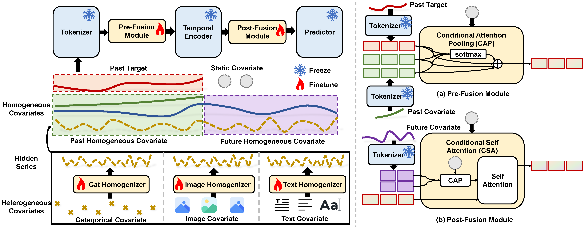

# UniCA: Adapting Time Series Foundation Model to General Covariate-Aware Forecasting

Official implementation of [UniCA](https://arxiv.org/abs/2506.22039), a unified framework for adapting Time Series Foundation Models (TSFMs) to
general covariate-aware forecasting tasks, including heterogeneous and multimodal inputs.

---

## 🧠 Overview

Time Series Foundation Models (TSFMs) achieve impressive generalization through large-scale pretraining, but struggle to
handle *heterogeneous covariates* (e.g., categorical features, images, text).




**UniCA** addresses this limitation via:

* **Covariate Homogenization**: Transforms diverse covariates into a high-order homogeneous representation.
* **Attention-based Fusion**: Integrates covariate features while preserving TSFM’s temporal modeling capacity.
* **Plug-and-Play Adaptation**: UniCA acts as an adapter module that does **not modify** pretrained TSFM parameters.




UniCA supports a wide range of scenarios: single-modal, multimodal, homogeneous, and heterogeneous covariates.

---


## 📊 Datasets

We evaluate UniCA on both unimodal and multimodal datasets:

* 12 datasets, _e.g._ M5, Retail, EPF ... (unimodal time series)
* Time-MMD (text + time series)
* MMSP (image + time series)

---

## 🚀 Quick Start

### 1. Environment

create a new conda environment and install dependencies:

```bash
conda create -n unica python=3.10
conda activate unica
pip install -r requirements.txt
```

define the path to your pretrained model and dataset:

```bash
export MODEL_PATH=/your/pretrained/model/path
export DATA_PATH=/your/dataset/path
```

### 2. Pretrained Model

In the paper, we apply UniCA on the following TSFMs:

- [Chronos-Bolt-base](https://huggingface.co/amazon/chronos-bolt-base)
- [TimesFM-2-500m](https://huggingface.co/google/timesfm-2.0-500m-pytorch)
- [MOMENT-1 (small/base/large)](https://huggingface.co/AutonLab/MOMENT-1-large)

Download the checkpoints from Hugging Face (place each folder under `[MODEL_PATH]`). For MOMENT support make sure the
`momentfm` Python package is installed (it is included in `requirements.txt`) and select the adapter with
`--base_model moment_1_small|moment_1_base|moment_1_large`.

To leverage MOMENT for anomaly detection instead of forecasting, instantiate the wrapper in anomaly mode:

```python
from models.wrapper.fm.moment_wrapper import MomentWrapper

wrapper = MomentWrapper(
    model_id_or_path=f"{MODEL_PATH}/MOMENT-1-base",
    prediction_length=96,
    moment_task="anomaly_detection",
)
scores, reconstruction = wrapper.detect_anomalies(context_tensor, observed_mask)
```

This runs MOMENT’s reconstruction head and returns per-timestep anomaly scores alongside the reconstructed signal.


### 3. Data Preparation

Download the datasets from [drive](https://drive.google.com/file/d/166YnyeFcVYKXNL8MyU2cp6jd9cAnSaIH/view) and place them in the `[DATA_PATH]` directory. The directory structure should
look like this:

```bash
[DATA_PATH]/
├── hog/
├── epf/
├── pdb/
└── ...
```

### 4. Reproduce results in paper

This repo uses `wandb` to log the training process. You can set up your `wandb` account and login before running the
code:

```bash
wandb login
```

To reproduce the results in the paper, run the following command:

- For unimodal time series forecasting:

```bash
bash scripts/unimodal.sh
```

- For EPF subsets time series forecasting:

```bash
bash scripts/epf_sub.sh
```

- For MMSP (image + time series) multimodal forecasting:

```bash
bash scripts/mmsp.sh
```

- For Time-MMD (text + time series) multimodal forecasting:

```bash
bash scripts/time-mmd.sh
```

The results are logged to the `Datasets Evaluation` table.

---

## 🔧 Linear Covariate Adapter

UniCA now exposes a *zero-shot* covariate adapter that mirrors the linear
regression strategy introduced in the
[TimesFM covariates notebook](https://github.com/google-research/timesfm/blob/master/v1/notebooks/covariates.ipynb).

- The adapter fits a closed-form linear regression between contextual targets
  and the available covariates (dynamic + static) to capture deterministic
  effects.
- Residuals are then passed to the frozen TSFM which forecasts future residuals.
- Future covariate contributions are obtained via the same regression and added
  back to the TSFM output (`y = y_residual + y_linear`).
- If a covariate is only observed historically, the TSFM first forecasts its
  future values so that the regression can still operate purely on
  future-known signals.

Use it by selecting the adapter name:

```bash
python main.py \
  --model_name ts_adapter/linear_regression \
  --base_model chronos_bolt_base \
  --datasets cov_all --split_val
```

Substitute `--base_model timesfm_2_500m` to reproduce the TimesFM-style
xreg+TSFM fusion on Google’s checkpoint.


---

## 🧪 Results

UniCA consistently improves performance over strong TSFM baselines across multiple metrics (MAE, MAPE, CRPS, etc.) and
covariate setups. See full results in our paper.
